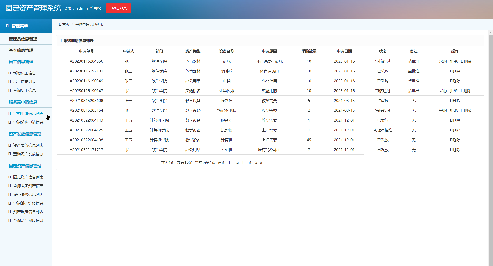
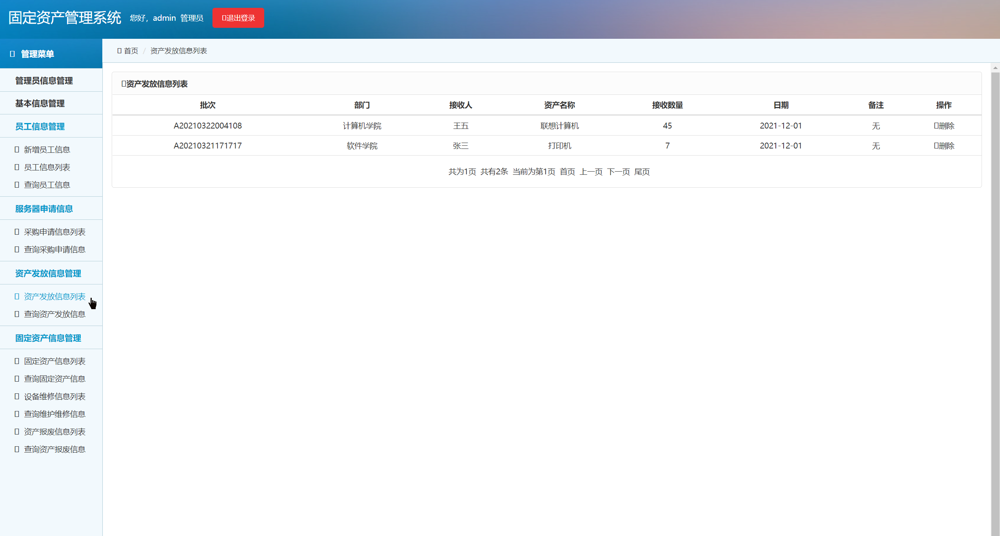
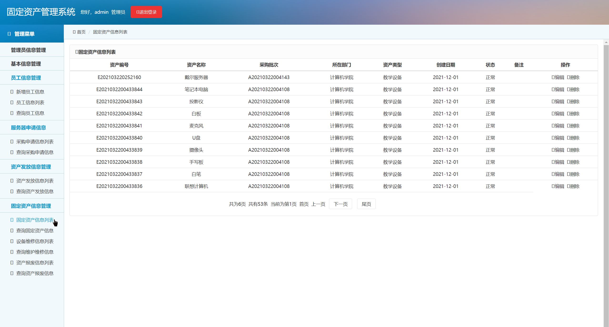
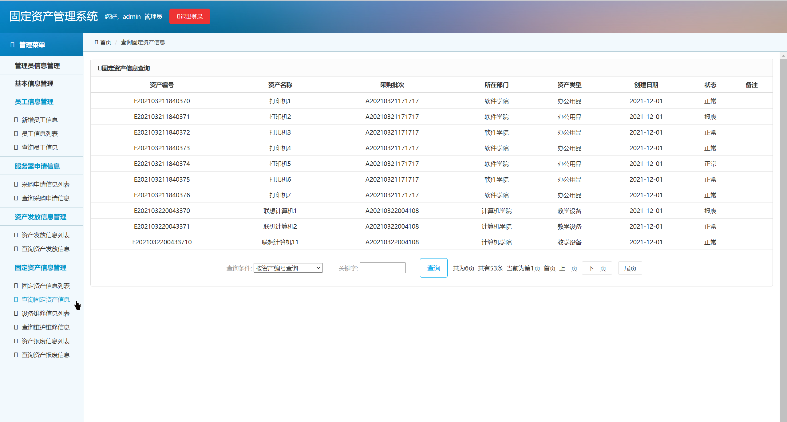
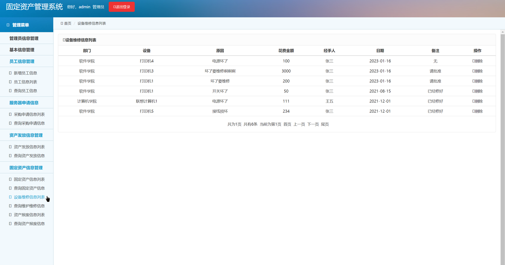
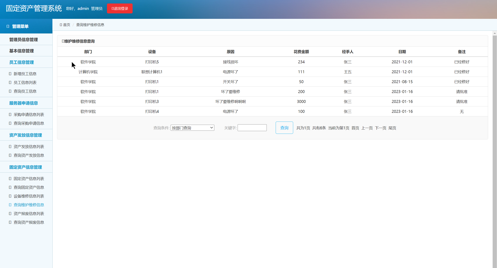
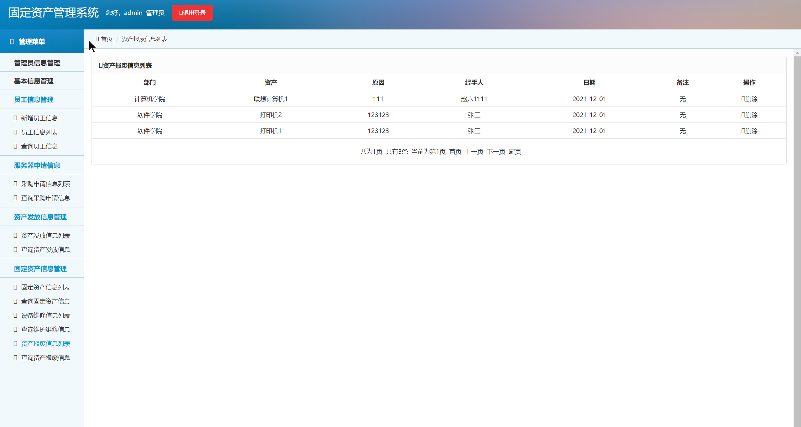
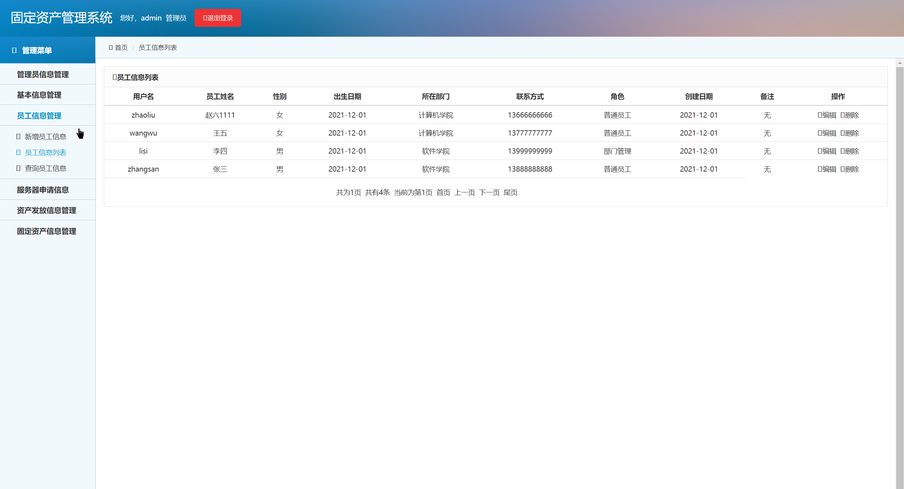

## 基于SSM实现的固定资产管理系统

###  获取sql数据库文件: 从戎源码网 (https://armycodes.com/) QQ: 386869957 QQ群: 377586148
###  所有系统地址: (https://github.com/YuLin-Coder/AllProjectCatalog) 
###  所有项目以及源代码本人均调试运行无问题 可支持远程安装部署调试、定制修改、代码讲解

## 项目介绍
基于SSM实现的固定资产管理系统，该固定资产管理系统共包含三种角色，分别是：管理员、普通员工、部门管理人员，其功能如下：
1.管理员
系统登陆、管理员管理、部门管理、资产类型管理、员工信息管理、采购申请管理、资产采购管理、资产发放管理、固定资产管理、设备维修管理、资产报废管理、设备借用归还管理、盘点信息管理、盘盈信息统计、盘亏信息统计等功能。
2.普通员工
个人信息管理、修改密码、资产类型信息、采购申请信息、资产接收信息、固定资产信息、设备借用归还信息、盘点信息等功能。
3.部门管理人员
工作人员管理、基础信息管理、采购申请管理、资产发放管理、固定资产管理、设备借用归还管理、盘点管理等功能。

## 项目技术
- 编程语言：Java
- 数据库：MySQL
- 前端技术：JSP、jQuery 、ECharts
- 后端技术：Spring、SpringMVC、MyBatis

## 运行环境
- JDK版本：JDK1.8及以上
- 开发工具：IDEA、Ecplise、Myecplise都可以
- 数据库: MySQL5.7及以上
- Maven：maven3.0及以上

## 运行截图

